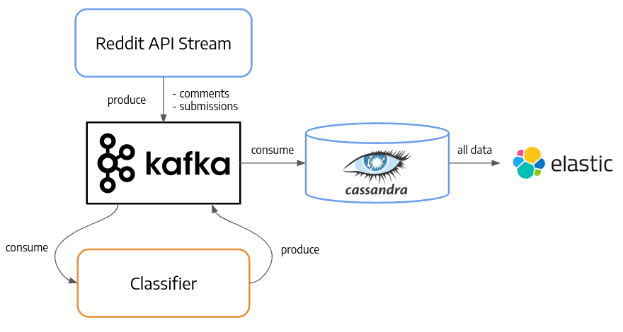

# The Reddit Streaming classifier

This project aim is to classify directly streamed reddit comments from some subreddits on some criteria.
In a first version this project detects hate speech comments from new comments or title of submission.

The project is written in Golang for the streaming components and the storage utilities and Python for 
the classification. The services communicate with Kafka and the data is stored in a cassandra database.




## Dependencies

Go: 
- [kafka](https://github.com/confluentinc/confluent-kafka-go)
- [cassandra driver](https://github.com/gocql/gocql)
- [reddit streaming](https://github.com/Baumanar/reddit_api_streaming)

Python:

- Keras
- Kafka

And others: [see python requirements](https://github.com/Baumanar/reddit_streaming_classifier/blob/master/reddit_classifier/requirements.txt)


## Requirements

A reddit account and a `reddit_kafka/auth.conf` file that looks like that:


```
CLIENT_ID=<client-id>
CLIENT_SECRET=<client-secret>
USER_AGENT=<user-agent>
USERNAME=<username>
PASSWORD=<password>
```

For further info check the  [reddit api doc](https://www.reddit.com/dev/api/) and the [API access rules](https://github.com/reddit-archive/reddit/wiki/OAuth2 )


## Build & Run instructions:

Setup the environnemnt in `reddit_classifier`:

- Create a virtual env: `python3 -m venv venv`
- Activate the virtual env: `. venv/bin/activate`
- Install the required packages : `pip3 install -r requirements.txt`

- Train the word2vec model: `python train_word2vec.py`
- Train the hate speech classifier: `python train_lstm.py`


To run everything together:

- Build the images: `docker-compose -f docker-compose.yml build`
- Run the docker-compose: `docker-compose -f docker-compose.yml up`


## Kubernetes setup

If you want to deploy this project to kubernetes, see the kubernetes [README](kube-deploy/README.md)